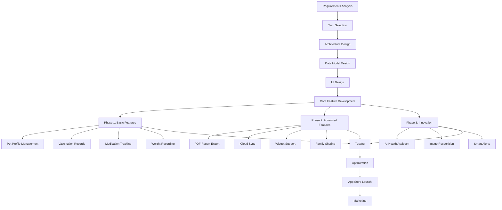
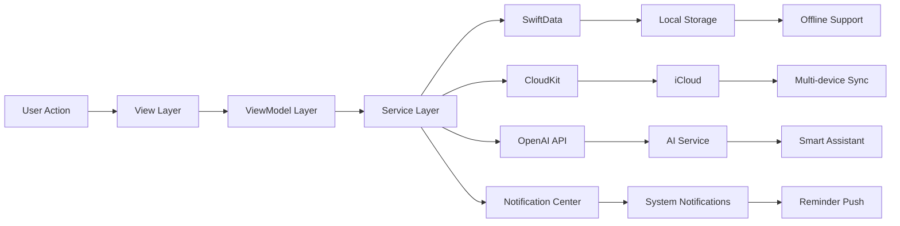
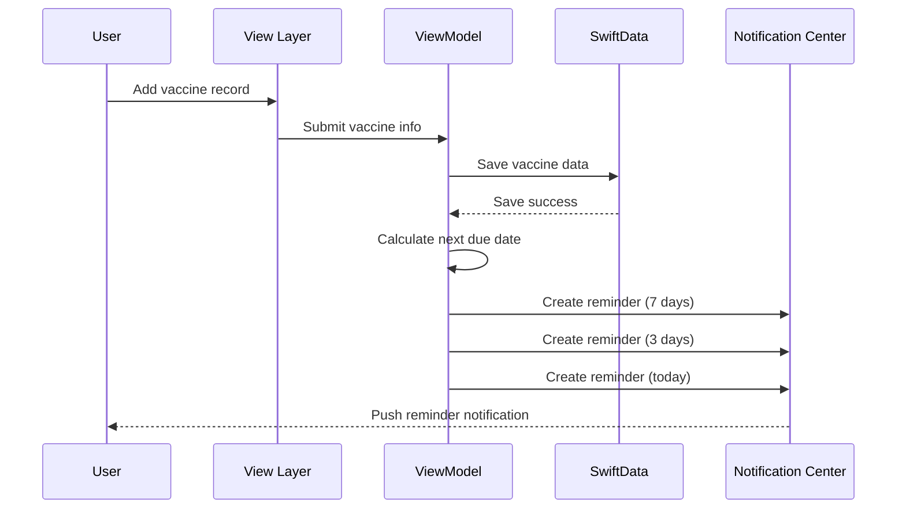
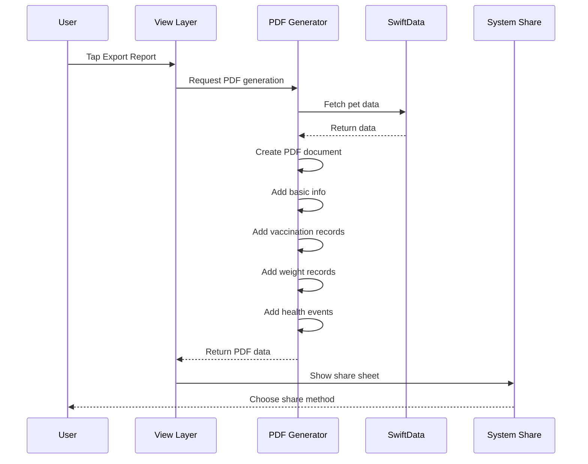
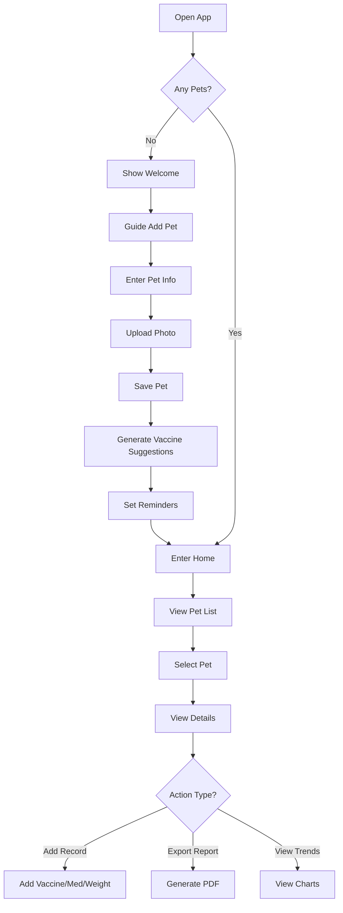
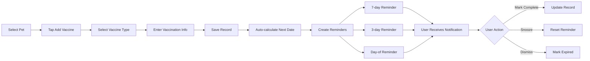
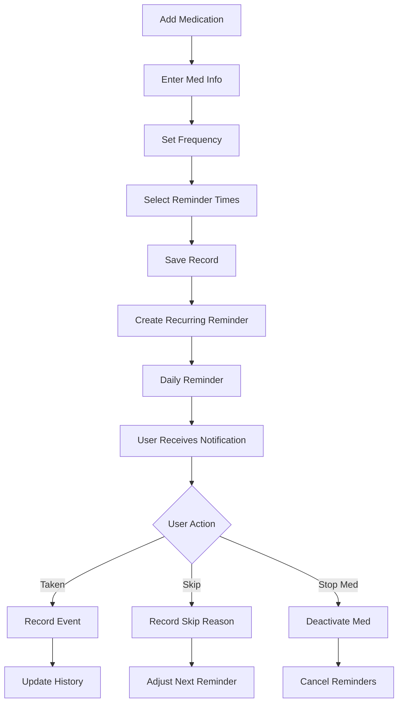

# 🐾 PetHealthData - iOS App Development Guide
## US Market Version | Operation Manual

---

> **Project Overview**: Pet health management app for US market, helping pet owners track multiple pets' health records, vaccination schedules, and medication details  
> **Pain Point Level**: 🥇 Gold (Score: 84/100)  
> **Target Market**: 🇺🇸 United States (Primary), 🇧🇷 Brazil, 🇯🇵 Japan  
> **Tech Difficulty**: ⭐⭐ Simple  
> **Development Cycle**: 4-5 weeks  
> **Business Model**: Freemium (Basic Free + Pro $3.99 one-time purchase)

---

## 📋 Table of Contents

1. [Executive Summary](#1-executive-summary)
2. [US Market Research](#2-us-market-research)
3. [Competitor Analysis](#3-competitor-analysis)
4. [Apple App Store Guidelines](#4-apple-app-store-guidelines)
5. [GitHub Projects Analysis](#5-github-projects-analysis)
6. [UI/UX Design Specification](#6-uiux-design-specification)
7. [Technical Architecture](#7-technical-architecture)
8. [Implementation Guide](#8-implementation-guide)
9. [Code Generation Rules](#9-code-generation-rules)
10. [Validation & Testing Standards](#10-validation--testing-standards)
11. [Build & Compilation Guide](#11-build--compilation-guide)
12. [UI Acceptance Criteria](#12-ui-acceptance-criteria)
13. [Project Structure](#13-project-structure)

---

## 1. Executive Summary

### 1.1 Project Vision

Build a premium pet health management iOS app for US market with:
- **Multi-pet management** (dogs, cats, birds, small animals)
- **Vaccination tracking** with smart reminders
- **Medication management** with dosage tracking
- **Weight/health trend visualization**
- **PDF report generation** for vet visits
- **iCloud sync** for data backup

### 1.2 Target Audience (US Market)

| Segment | Age | Characteristics | Payment Willingness |
|---------|-----|----------------|---------------------|
| First-time pet owners | 25-35 | Need guidance, simple reminders | Medium ($3.99) |
| Multi-pet households | 30-45 | 3+ pets, separate records | High ($3.99+) |
| Senior pet caregivers | 35-55 | Frequent meds, vet visits | High ($3.99+) |

### 1.3 MVP Feature List (Priority Order)

| Priority | Feature | Description |
|----------|---------|-------------|
| P0 | Multi-pet profiles | Add, edit, delete pets with photo, breed, birthdate |
| P0 | Vaccination records | Track vaccines with next due dates |
| P0 | Medication tracking | Track meds with dosage, frequency, reminders |
| P0 | Weight logging | Record weight over time with charts |
| P1 | PDF export | Generate vet-ready health reports |
| P1 | iCloud sync | Backup data across devices |
| P2 | Widget | Quick view on home screen |
| P2 | Family sharing | Share pet data with family members |

---

## 2. US Market Research

### 2.1 Market Size

- **US Pet Ownership**: 66% of US households (86.9 million homes)
- **Pet Types**: Dogs (65M), Cats (46M), Small pets (12M), Birds (6M)
- **Annual Pet Spending**: $14.1 billion on veterinary care
- **App Store Category**: Health & Fitness / Lifestyle

### 2.2 User Pain Points (US Focus)

Based on Reddit, Twitter, and US pet forum research:

1. **Multi-pet management chaos**
   - "I have 3 dogs and 2 cats, can't keep track of who's due for what"
   
2. **Vaccination schedule missed**
   - "Almost missed my dog's rabies vaccine, scared me"

3. **Medication tracking confusion**
   - "My senior dog needs 3 different meds, I keep forgetting"

4. **Vet visit preparation**
   - "Vet asked for history, I had nothing to show"

5. **Health trends invisible**
   - "Didn't realize my cat lost weight until she got sick"

### 2.3 Pricing Strategy (US Market)

| Tier | Price | Features |
|------|-------|----------|
| Free | $0 | 1 pet, basic tracking, ads |
| Pro | $3.99 (one-time) | Unlimited pets, no ads, PDF export, iCloud sync |

---

## 3. Competitor Analysis

### 3.1 Direct Competitors (US App Store)

| App | Rating | Price | Strengths | Weaknesses |
|-----|--------|-------|-----------|------------|
| **Petfetti** | 4.8⭐ | $4.99/mo | AI features, modern UI | Subscription only |
| **Pet Care Tracker** | 4.5⭐ | Free | Free, feature-rich | Dated UI |
| **DogCare AI** | 4.6⭐ | $2.99 | AI assistant | Dog-only |
| **That Pet App** | 4.4⭐ | $1.99 | Simple interface | Limited features |
| **11pets** | 4.3⭐ | $4.99/mo | Comprehensive | Complex UI |

### 3.2 Competitive Gap Analysis

| Gap | Opportunity | Recommendation |
|-----|-------------|----------------|
| **Price gap** | Most competitors use subscription | Use one-time purchase (Pro $3.99) |
| **Multi-pet UX** | Complex interfaces | Simple card-based UI |
| **PDF Export** | Rare in competitors | Highlight as key feature |
| **Offline-first** | Many require internet | Full offline support |

### 3.3 Differentiation Strategy

1. **One-time payment** vs. monthly subscriptions
2. **Clean, modern SwiftUI design** (vs. dated UI)
3. **Native iOS performance** (vs. hybrid)
4. **Pet-friendly illustrations** and warm color palette

---

## 4. Apple App Store Guidelines

### 4.1 Key Guidelines for Pet Health Apps

#### Safety Requirements (Section 1)
- ✅ No harmful content
- ✅ No violent or offensive content
- ✅ No user-generated content issues
- ✅ Must comply with COPPA (children's privacy)

#### Performance Requirements (Section 2)
- ✅ Complete and robust app
- ✅ No crashes or bugs
- ✅ Functional API connections
- ✅ Accurate metadata

#### Business Requirements (Section 3)
- ✅ Clear in-app purchase descriptions
- ✅ NoManipulate App Store rankings
- ✅ Proper subscription/freemium disclosure

#### Design Requirements (Section 4)
- ✅ Apple Human Interface Guidelines compliance
- ✅ Support all required device sizes
- ✅ Localized for US market (English)

### 4.2 Health App Specific Guidelines

Since this is a **pet** health app (not human health):

- ✅ Not subject to HIPAA requirements
- ✅ Not required to be a medical device
- ✅ Can use HealthKit optionally for human health data sync
- ⚠️ Must NOT claim to diagnose/treat pet diseases

### 4.3 App Store Metadata Requirements

| Field | Requirement |
|-------|-------------|
| App Name | PetHealthData (30 chars max) |
| Subtitle | Pet Health Tracker for iOS (30 chars) |
| Description | 4000 chars max, clear feature list |
| Keywords | pet, health, tracker, dog, cat, vaccine, medication (100 chars) |
| Screenshots | 6.5" and 5.5" required |
| Privacy Policy | Required (can use placeholder for dev) |

### 4.4 Technical Requirements

- **Minimum iOS Version**: iOS 16.0+
- **Xcode**: 15.0+
- **Swift**: 5.9+
- **Architecture**: arm64

---

## 5. GitHub Projects Analysis

### 5.1 Cloned Projects

All GitHub projects from the document have been successfully cloned:

| Project | URL | Status |
|---------|-----|--------|
| **Pet-Pro-IOS** | https://github.com/AseshNemal/Pet-Pro-IOS | ✅ Cloned |
| **PetCare** | https://github.com/Jhonatan19991/PetCare | ✅ Cloned |
| **PetFlow** | https://github.com/Lukieboy/PetFlow | ✅ Cloned |
| **dotcat-petcare** | https://github.com/ogulcan-tekinalp/dotcat-petcare | ✅ Cloned |
| **pet-care-tracker** | https://github.com/ishaniekanayaka/pet-care-tracker | ✅ Cloned |

### 5.2 Pet-Pro-IOS Analysis (Primary Reference)

**Path**: `./Pet-Pro-IOS/`

**Project Structure** (to convert to native):
```
Pet-Pro-IOS/
├── Models/
│   ├── Pet.swift              → Convert to SwiftData
│   ├── Vaccine.swift          → Convert to SwiftData
│   └── Medication.swift       → Convert to SwiftData
├── Views/
│   ├── PetListView.swift      → Reference UI patterns
│   ├── PetDetailView.swift    → Reference UI patterns
│   └── AddPetView.swift       → Reference UI patterns
├── ViewModels/
│   └── PetViewModel.swift     → Convert to @Observable
└── Services/
    └── FirebaseService.swift  → Convert to CloudKit
```

**Key Features to Extract**:
1. ✅ Pet CRUD operations
2. ✅ Vaccine record management
3. ✅ Medication tracking
4. ✅ Health statistics visualization

### 5.3 Conversion Strategy

| Source | Target (Native iOS) |
|--------|---------------------|
| React Components | SwiftUI Views |
| TypeScript Models | Swift Structs/Classes |
| Supabase/Firebase | SwiftData + CloudKit |
| React Navigation | SwiftUI NavigationStack |
| Tailwind CSS | SwiftUI + Custom Styles |

---

## 6. UI/UX Design Specification

### 6.1 Design Philosophy

Based on 2025 iOS trends and US market preferences:

1. **Liquid Glass / Glassmorphism** - Translucent, modern UI elements
2. **Bento Grid Layouts** - Organized content blocks
3. **Rounded Corners** - Soft, friendly edges (16-20pt radius)
4. **Warm Color Palette** - Pet-friendly, approachable
5. **Dynamic Type** - Accessibility support

### 6.2 Color Palette

| Purpose | Color | Hex Code |
|---------|-------|----------|
| Primary | Teal Blue | #0A84FF |
| Secondary | Soft Coral | #FF6B6B |
| Accent | Warm Yellow | #FFD93D |
| Background | Off-White | #F8F9FA |
| Card Background | Pure White | #FFFFFF |
| Text Primary | Dark Gray | #1A1A1A |
| Text Secondary | Medium Gray | #6B7280 |
| Success | Green | #34C759 |
| Warning | Orange | #FF9500 |
| Error | Red | #FF3B30 |

### 6.3 Pet Type Colors

| Pet Type | Color | SF Symbol |
|----------|-------|-----------|
| Dog | Blue | dog.fill |
| Cat | Pink | cat.fill |
| Bird | Green | bird.fill |
| Other | Orange | pawprint.fill |

### 6.4 Typography

| Element | Font | Size | Weight |
|---------|------|------|--------|
| App Title | SF Pro Display | 34pt | Bold |
| Screen Title | SF Pro Display | 28pt | Bold |
| Section Header | SF Pro Text | 20pt | Semibold |
| Body Text | SF Pro Text | 17pt | Regular |
| Caption | SF Pro Text | 13pt | Regular |
| Button | SF Pro Text | 17pt | Semibold |

### 6.5 Spacing System (8pt Grid)

| Token | Value | Usage |
|-------|-------|-------|
| xs | 4pt | Tight spacing |
| sm | 8pt | Icon gaps |
| md | 16pt | Standard padding |
| lg | 24pt | Section spacing |
| xl | 32pt | Screen margins |

### 6.6 Component Library

#### Primary Button
- Background: Primary (#0A84FF)
- Text: White, 17pt Semibold
- Corner Radius: 12pt
- Height: 50pt
- States: Default, Pressed (opacity 0.8), Disabled (opacity 0.5)

#### Secondary Button
- Background: Transparent
- Border: 1.5pt Primary (#0A84FF)
- Text: Primary, 17pt Semibold
- Corner Radius: 12pt
- Height: 50pt

#### Card Component
- Background: White (#FFFFFF)
- Shadow: 0pt 2pt 8pt rgba(0,0,0,0.08)
- Corner Radius: 16pt
- Padding: 16pt

#### Input Field
- Background: #F3F4F6
- Border: None (default), 1.5pt Primary (focused)
- Corner Radius: 10pt
- Height: 48pt
- Padding: 16pt horizontal

#### Pet Avatar
- Size: 80pt x 80pt
- Corner Radius: 40pt (circle)
- Border: 2pt pet-type color
- Placeholder: SF Symbol "pawprint.fill"

---

## 7. Technical Architecture

### 7.1 Architecture Pattern: MVVM + SwiftData

```
┌─────────────────────────────────────────────┐
│                  View Layer                  │
│  ┌──────────┐  ┌──────────┐  ┌──────────┐  │
│  │PetListView│  │PetDetailView│ │SettingsView│ │
│  └──────────┘  └──────────┘  └──────────┘  │
└─────────────────────────────────────────────┘
                    ↓ @Query / @Bindable
┌─────────────────────────────────────────────┐
│               ViewModel Layer                │
│  ┌──────────┐  ┌──────────┐  ┌──────────┐  │
│  │PetListVM │  │PetDetailVM│  │SettingsVM│  │
│  └──────────┘  └──────────┘  └──────────┘  │
└─────────────────────────────────────────────┘
                    ↓ ModelContext
┌─────────────────────────────────────────────┐
│                Model Layer                   │
│  ┌──────────┐  ┌──────────┐  ┌──────────┐  │
│  │   Pet    │  │ Vaccine  │  │Medication│  │
│  └──────────┘  └──────────┘  └──────────┘  │
│  ┌──────────┐  ┌──────────┐                 │
│  │WeightRecord│ │HealthEvent│                │
│  └──────────┘  └──────────┘                 │
└─────────────────────────────────────────────┘
                    ↓ CloudKit Sync
┌─────────────────────────────────────────────┐
│              Persistence Layer               │
│  ┌─────────────────────────────────────┐   │
│  │     SwiftData + CloudKit            │   │
│  │  (Local-first, auto sync)           │   │
│  └─────────────────────────────────────┘   │
└─────────────────────────────────────────────┘
```

### 7.2 Tech Stack

| Layer | Technology | Version |
|-------|------------|---------|
| Language | Swift | 5.9+ |
| UI Framework | SwiftUI | iOS 17+ |
| Data Persistence | SwiftData | iOS 17+ |
| Cloud Sync | CloudKit | Native |
| Charts | Swift Charts | Native |
| PDF Generation | PDFKit | Native |
| Notifications | UserNotifications | Native |
| Navigation | NavigationStack | Native |
| Image Handling | PhotosUI | Native |

### 7.3 Dependencies (Minimal)

**Philosophy**: Use 100% native Apple frameworks to ensure:
- Best performance
- Automatic updates
- No third-party maintenance burden
- App Store approval confidence

| Package | Purpose | Status |
|---------|---------|--------|
| SwiftUI | UI Framework | Native - NO ADD |
| SwiftData | Data Persistence | Native - NO ADD |
| Swift Charts | Data Visualization | Native - NO ADD |
| PDFKit | PDF Generation | Native - NO ADD |
| UserNotifications | Push Notifications | Native - NO ADD |

---

## 8. Implementation Guide

### 8.1 Data Models (SwiftData)

#### Pet Model
```swift
import Foundation
import SwiftData

@Model
final class Pet {
    var id: UUID
    var name: String
    var species: String      // "dog", "cat", "bird", "other"
    var breed: String?
    var birthDate: Date?
    var weight: Double
    var photoData: Data?
    var notes: String?
    var createdAt: Date
    var updatedAt: Date
    
    @Relationship(deleteRule: .cascade, inverse: \VaccineRecord.pet)
    var vaccines: [VaccineRecord]
    
    @Relationship(deleteRule: .cascade, inverse: \Medication.pet)
    var medications: [Medication]
    
    @Relationship(deleteRule: .cascade, inverse: \WeightRecord.pet)
    var weightRecords: [WeightRecord]
    
    @Relationship(deleteRule: .cascade, inverse: \HealthEvent.pet)
    var healthEvents: [HealthEvent]
    
    var age: String {
        guard let birthDate = birthDate else { return "Unknown" }
        let calendar = Calendar.current
        let years = calendar.dateComponents([.year], from: birthDate, to: Date()).year ?? 0
        let months = calendar.dateComponents([.month], from: birthDate, to: Date()).month ?? 0
        
        if years > 0 {
            return "\(years) year\(years == 1 ? "" : "s") old"
        } else {
            return "\(months) month\(months == 1 ? "" : "s") old"
        }
    }
    
    var speciesIcon: String {
        switch species.lowercased() {
        case "dog": return "dog.fill"
        case "cat": return "cat.fill"
        case "bird": return "bird.fill"
        default: return "pawprint.fill"
        }
    }
}
```

#### VaccineRecord Model
```swift
import Foundation
import SwiftData

@Model
final class VaccineRecord {
    var id: UUID
    var vaccineName: String
    var vaccinationDate: Date
    var nextDueDate: Date?
    var veterinarian: String?
    var notes: String?
    var createdAt: Date
    var pet: Pet?
    
    var isOverdue: Bool {
        guard let nextDueDate = nextDueDate else { return false }
        return nextDueDate < Date()
    }
    
    var daysUntilDue: Int? {
        guard let nextDueDate = nextDueDate else { return nil }
        let calendar = Calendar.current
        return calendar.dateComponents([.day], from: Date(), to: nextDueDate).day
    }
}
```

#### Medication Model
```swift
import Foundation
import SwiftData

@Model
final class Medication {
    var id: UUID
    var name: String
    var dosage: String
    var frequency: String    // "daily", "twice_daily", "weekly", "as_needed"
    var reminderTimes: [Date]
    var startDate: Date
    var endDate: Date?
    var notes: String?
    var isActive: Bool
    var createdAt: Date
    var pet: Pet?
    
    var frequencyText: String {
        switch frequency {
        case "daily": return "Daily"
        case "twice_daily": return "Twice Daily"
        case "weekly": return "Weekly"
        case "as_needed": return "As Needed"
        default: return frequency
        }
    }
}
```

#### WeightRecord Model
```swift
import Foundation
import SwiftData

@Model
final class WeightRecord {
    var id: UUID
    var weight: Double
    var weightUnit: String   // "lbs", "kg"
    var date: Date
    var notes: String?
    var createdAt: Date
    var pet: Pet?
}
```

#### HealthEvent Model
```swift
import Foundation
import SwiftData

@Model
final class HealthEvent {
    var id: UUID
    var eventType: String    // "checkup", "vaccine", "medication", "grooming", "other"
    var title: String
    var eventDescription: String?
    var date: Date
    var attachmentsData: [Data]?
    var createdAt: Date
    var pet: Pet?
    
    var eventTypeIcon: String {
        switch eventType {
        case "checkup": return "stethoscope"
        case "vaccine": return "syringe"
        case "medication": return "pills.fill"
        case "grooming": return "scissors"
        default: return "heart.fill"
        }
    }
}
```

### 8.2 ViewModels (@Observable)

#### PetListViewModel
```swift
import Foundation
import SwiftData
import SwiftUI

@Observable
final class PetListViewModel {
    var pets: [Pet] = []
    var searchText: String = ""
    var isLoading: Bool = false
    
    private var modelContext: ModelContext?
    
    func setup(modelContext: ModelContext) {
        self.modelContext = modelContext
        fetchPets()
    }
    
    func fetchPets() {
        guard let modelContext = modelContext else { return }
        
        let descriptor = FetchDescriptor<Pet>(
            sortBy: [SortDescriptor(\.name)]
        )
        
        do {
            pets = try modelContext.fetch(descriptor)
        } catch {
            print("Failed to fetch pets: \(error)")
        }
    }
    
    func deletePet(_ pet: Pet) {
        guard let modelContext = modelContext else { return }
        modelContext.delete(pet)
        try? modelContext.save()
        fetchPets()
    }
    
    var filteredPets: [Pet] {
        if searchText.isEmpty {
            return pets
        }
        return pets.filter { $0.name.localizedCaseInsensitiveContains(searchText) }
    }
}
```

### 8.3 Views (SwiftUI) - Key Components

#### Main App Entry
```swift
import SwiftUI
import SwiftData

@main
struct PetHealthDataApp: App {
    var sharedModelContainer: ModelContainer = {
        let schema = Schema([
            Pet.self,
            VaccineRecord.self,
            Medication.self,
            WeightRecord.self,
            HealthEvent.self
        ])
        let modelConfiguration = ModelConfiguration(
            schema: schema,
            isStoredInMemoryOnly: false,
            cloudKitDatabase: .automatic
        )
        
        do {
            return try ModelContainer(for: schema, configurations: [modelConfiguration])
        } catch {
            fatalError("Could not create ModelContainer: \(error)")
        }
    }()
    
    var body: some Scene {
        WindowGroup {
            ContentView()
        }
        .modelContainer(sharedModelContainer)
    }
}
```

#### PetListView
```swift
import SwiftUI
import SwiftData

struct PetListView: View {
    @Environment(\.modelContext) private var modelContext
    @Query(sort: \Pet.name) private var pets: [Pet]
    
    @State private var showingAddPet = false
    @State private var searchText = ""
    
    var body: some View {
        NavigationStack {
            ScrollView {
                LazyVStack(spacing: 16) {
                    if pets.isEmpty {
                        EmptyStateView()
                    } else {
                        ForEach(pets) { pet in
                            NavigationLink(destination: PetDetailView(pet: pet)) {
                                PetCardView(pet: pet)
                            }
                            .buttonStyle(.plain)
                        }
                    }
                }
                .padding(.horizontal, 16)
                .padding(.top, 8)
            }
            .background(Color(hex: "F8F9FA"))
            .navigationTitle("My Pets")
            .toolbar {
                ToolbarItem(placement: .topBarTrailing) {
                    Button {
                        showingAddPet = true
                    } label: {
                        Image(systemName: "plus.circle.fill")
                            .font(.title2)
                            .foregroundStyle(Color(hex: "0A84FF"))
                    }
                }
            }
            .sheet(isPresented: $showingAddPet) {
                AddPetView()
            }
            .searchable(text: $searchText, prompt: "Search pets")
        }
    }
}
```

#### PetCardView
```swift
import SwiftUI

struct PetCardView: View {
    let pet: Pet
    
    var body: some View {
        HStack(spacing: 16) {
            PetAvatarView(pet: pet, size: 60)
            
            VStack(alignment: .leading, spacing: 4) {
                HStack {
                    Text(pet.name)
                        .font(.system(size: 20, weight: .semibold))
                        .foregroundStyle(Color(hex: "1A1A1A"))
                    
                    Spacer()
                    
                    Image(systemName: pet.speciesIcon)
                        .font(.system(size: 16))
                        .foregroundStyle(speciesColor)
                }
                
                if let breed = pet.breed, !breed.isEmpty {
                    Text(breed)
                        .font(.system(size: 14))
                        .foregroundStyle(Color(hex: "6B7280"))
                }
                
                Text(pet.age)
                    .font(.system(size: 14))
                    .foregroundStyle(Color(hex: "6B7280"))
                
                if let nextVaccine = upcomingVaccine {
                    HStack(spacing: 4) {
                        Image(systemName: "syringe")
                            .font(.system(size: 12))
                        Text("Due: \(nextVaccine)")
                            .font(.system(size: 12))
                    }
                    .foregroundStyle(Color(hex: "FF9500"))
                }
            }
            
            Image(systemName: "chevron.right")
                .font(.system(size: 14, weight: .medium))
                .foregroundStyle(Color(hex: "6B7280"))
        }
        .padding(16)
        .background(Color.white)
        .clipShape(RoundedRectangle(cornerRadius: 16))
        .shadow(color: .black.opacity(0.08), radius: 8, x: 0, y: 2)
    }
    
    var speciesColor: Color {
        switch pet.species.lowercased() {
        case "dog": return Color(hex: "0A84FF")
        case "cat": return Color(hex: "FF6B6B")
        case "bird": return Color(hex: "34C759")
        default: return Color(hex: "FFD93D")
        }
    }
    
    var upcomingVaccine: String? {
        let upcoming = pet.vaccines
            .filter { $0.nextDueDate != nil && !($0.nextDueDate! < Date()) }
            .sorted { ($0.nextDueDate ?? .distantFuture) < ($1.nextDueDate ?? .distantFuture) }
            .first
        
        guard let vaccine = upcoming, let dueDate = vaccine.nextDueDate else { return nil }
        
        let days = Calendar.current.dateComponents([.day], from: Date(), to: dueDate).day ?? 0
        
        if days <= 7 {
            return "in \(days) days"
        } else {
            return "in \(days / 7) weeks"
        }
    }
}
```

#### PetAvatarView
```swift
import SwiftUI

struct PetAvatarView: View {
    let pet: Pet
    let size: CGFloat
    
    var body: some View {
        Group {
            if let photoData = pet.photoData,
               let uiImage = UIImage(data: photoData) {
                Image(uiImage: uiImage)
                    .resizable()
                    .scaledToFill()
            } else {
                Image(systemName: pet.speciesIcon)
                    .font(.system(size: size * 0.4))
                    .foregroundStyle(.white)
            }
        }
        .frame(width: size, height: size)
        .background(speciesColor)
        .clipShape(Circle())
        .overlay(
            Circle()
                .stroke(speciesColor.opacity(0.3), lineWidth: 2)
        )
    }
    
    var speciesColor: Color {
        switch pet.species.lowercased() {
        case "dog": return Color(hex: "0A84FF")
        case "cat": return Color(hex: "FF6B6B")
        case "bird": return Color(hex: "34C759")
        default: return Color(hex: "FFD93D")
        }
    }
}
```

### 8.4 PDF Export Service
```swift
import PDFKit
import SwiftUI

struct PDFExportService {
    
    static func generateHealthReport(for pet: Pet) -> Data? {
        let pageWidth: CGFloat = 612
        let pageHeight: CGFloat = 792
        let margin: CGFloat = 50
        
        let pdfMetaData = [
            kCGPDFContextCreator: "PetHealthData",
            kCGPDFContextAuthor: "PetHealthData App",
            kCGPDFContextTitle: "\(pet.name) Health Report"
        ]
        
        let format = UIGraphicsPDFRendererFormat()
        format.documentInfo = pdfMetaData as [String: Any]
        
        let pageRect = CGRect(x: 0, y: 0, width: pageWidth, height: pageHeight)
        let renderer = UIGraphicsPDFRenderer(bounds: pageRect, format: format)
        
        let data = renderer.pdfData { context in
            context.beginPage()
            
            var yPosition: CGFloat = margin
            
            let titleFont = UIFont.boldSystemFont(ofSize: 24)
            let title = "\(pet.name) - Health Report"
            title.draw(at: CGPoint(x: margin, y: yPosition), withAttributes: [
                .font: titleFont,
                .foregroundColor: UIColor.black
            ])
            yPosition += 40
            
            let headerFont = UIFont.boldSystemFont(ofSize: 16)
            let bodyFont = UIFont.systemFont(ofSize: 12)
            
            "Pet Information".draw(at: CGPoint(x: margin, y: yPosition), withAttributes: [
                .font: headerFont,
                .foregroundColor: UIColor.black
            ])
            yPosition += 25
            
            "Name: \(pet.name)".draw(at: CGPoint(x: margin, y: yPosition), withAttributes: [
                .font: bodyFont,
                .foregroundColor: UIColor.darkGray
            ])
            yPosition += 18
            
            if let breed = pet.breed {
                "Breed: \(breed)".draw(at: CGPoint(x: margin, y: yPosition), withAttributes: [
                    .font: bodyFont,
                    .foregroundColor: UIColor.darkGray
                ])
                yPosition += 18
            }
            
            "Species: \(pet.species)".draw(at: CGPoint(x: margin, y: yPosition), withAttributes: [
                .font: bodyFont,
                .foregroundColor: UIColor.darkGray
            ])
            yPosition += 18
            
            if let birthDate = pet.birthDate {
                "Age: \(pet.age)".draw(at: CGPoint(x: margin, y: yPosition), withAttributes: [
                    .font: bodyFont,
                    .foregroundColor: UIColor.darkGray
                ])
                yPosition += 30
            }
            
            if !pet.vaccines.isEmpty {
                "Vaccination Records".draw(at: CGPoint(x: margin, y: yPosition), withAttributes: [
                    .font: headerFont,
                    .foregroundColor: UIColor.black
                ])
                yPosition += 25
                
                for vaccine in pet.vaccines {
                    "\(vaccine.vaccineName) - Given: \(vaccine.vaccinationDate.formatted(date: .abbreviated, time: .omitted))".draw(
                        at: CGPoint(x: margin, y: yPosition),
                        withAttributes: [.font: bodyFont, .foregroundColor: UIColor.darkGray]
                    )
                    yPosition += 16
                    
                    if let nextDue = vaccine.nextDueDate {
                        "  Next due: \(nextDue.formatted(date: .abbreviated, time: .omitted))".draw(
                            at: CGPoint(x: margin, y: yPosition),
                            withAttributes: [.font: bodyFont, .foregroundColor: UIColor.gray]
                        )
                        yPosition += 16
                    }
                }
                yPosition += 15
            }
            
            if !pet.medications.isEmpty {
                "Medication Records".draw(at: CGPoint(x: margin, y: yPosition), withAttributes: [
                    .font: headerFont,
                    .foregroundColor: UIColor.black
                ])
                yPosition += 25
                
                for med in pet.medications {
                    "\(med.name) - \(med.dosage) - \(med.frequencyText)".draw(
                        at: CGPoint(x: margin, y: yPosition),
                        withAttributes: [.font: bodyFont, .foregroundColor: UIColor.darkGray]
                    )
                    yPosition += 16
                }
            }
            
            let footerFont = UIFont.systemFont(ofSize: 10)
            let footer = "Generated by PetHealthData on \(Date().formatted(date: .abbreviated, time: .shortened))"
            footer.draw(at: CGPoint(x: margin, y: pageHeight - margin), withAttributes: [
                .font: footerFont,
                .foregroundColor: UIColor.gray
            ])
        }
        
        return data
    }
}
```

### 8.5 Notification Service
```swift
import UserNotifications

struct NotificationService {
    static func requestAuthorization() async -> Bool {
        do {
            let options: UNAuthorizationOptions = [.alert, .badge, .sound]
            return try await UNUserNotificationCenter.current().requestAuthorization(options: options)
        } catch {
            print("Notification authorization error: \(error)")
            return false
        }
    }
    
    static func scheduleVaccineReminder(for vaccine: VaccineRecord, petName: String) {
        guard let nextDueDate = vaccine.nextDueDate else { return }
        
        let content = UNMutableNotificationContent()
        content.title = "Vaccination Reminder"
        content.body = "\(petName) is due for \(vaccine.vaccineName) vaccination"
        content.sound = .default
        content.badge = 1
        
        let reminderDate = Calendar.current.date(byAdding: .day, value: -7, to: nextDueDate) ?? nextDueDate
        
        let components = Calendar.current.dateComponents([.year, .month, .day], from: reminderDate)
        let trigger = UNCalendarNotificationTrigger(dateMatching: components, repeats: false)
        
        let request = UNNotificationRequest(
            identifier: vaccine.id.uuidString,
            content: content,
            trigger: trigger
        )
        
        UNUserNotificationCenter.current().add(request) { error in
            if let error = error {
                print("Failed to schedule notification: \(error)")
            }
        }
    }
    
    static func scheduleMedicationReminder(for medication: Medication, petName: String) {
        guard !medication.reminderTimes.isEmpty else { return }
        
        let content = UNMutableNotificationContent()
        content.title = "Medication Reminder"
        content.body = "Time to give \(petName) \(medication.name) (\(medication.dosage))"
        content.sound = .default
        
        for (index, time) in medication.reminderTimes.enumerated() {
            let components = Calendar.current.dateComponents([.hour, .minute], from: time)
            let trigger = UNCalendarNotificationTrigger(dateMatching: components, repeats: true)
            
            let request = UNNotificationRequest(
                identifier: "\(medication.id.uuidString)-\(index)",
                content: content,
                trigger: trigger
            )
            
            UNUserNotificationCenter.current().add(request)
        }
    }
}
```

---

## 9. Code Generation Rules

### 9.1 Module Organization Principles

Following the user's requirements:

#### Rule 1: Single Responsibility & High Cohesion
- **One feature = One module** (folder with related files)
- Each module should have a clear, focused purpose
- File naming should be semantic and clear

```
✅ GOOD:
/Modules/
  /PetManagement/
    ├── PetListView.swift
    ├── PetDetailView.swift
    ├── AddPetView.swift
    ├── PetCardView.swift
    └── PetViewModel.swift

  /Vaccination/
    ├── VaccinesListView.swift
    ├── AddVaccineView.swift
    └── VaccineViewModel.swift
```

#### Rule 2: Code Reuse & DRY (Don't Repeat Yourself)
- **Reuse existing components** before creating new ones
- **Extract to shared components** after 3+ repetitions
- Follow the **Rule of Three**: First time - write it, second time - copy with caution, third time - refactor

```swift
// Reusable component - put in /Shared/Components/
struct PetAvatarView: View { ... }
struct PrimaryButton: View { ... }
struct CardView: View { ... }

// If used 3+ times, extract to shared
// BAD: Copy-pasting the same button style
// GOOD: Create PrimaryButton component
```

#### Rule 3: Clean Code & Refactoring
- **Mark deprecated code** before removing
- **Verify no impact** before deletion
- **Commit with clear messages** explaining cleanup

```swift
// Before removing old code:
@available(*, deprecated, message: "Use PetAvatarView instead")
struct OldPetAvatarView: View { ... }

// After verification, delete in separate commit:
// Commit: "Remove deprecated OldPetAvatarView - superseded by PetAvatarView"
```

#### Rule 4: Convert Open Source to Native Swift
- **React/Web → SwiftUI**: Convert components to SwiftUI views
- **JavaScript logic → Swift**: Rewrite with Swift idioms
- **Web APIs → Native frameworks**: Use CloudKit, SwiftData

```swift
// JavaScript/React pattern:
const fetchPets = async () => { ... }

// Swift native pattern:
@Query(sort: \Pet.name) private var pets: [Pet]
```

#### Rule 5: Use Native Apple Frameworks
- **Prioritize native** over third-party
- **SwiftData** over Core Data (iOS 17+)
- **Swift Charts** over third-party charting
- **UserNotifications** for push

### 9.2 File Structure

```
pethealthdata/
├── App/
│   ├── PetHealthDataApp.swift
│   └── AppDelegate.swift (if needed)
├── Models/
│   ├── Pet.swift
│   ├── VaccineRecord.swift
│   ├── Medication.swift
│   ├── WeightRecord.swift
│   └── HealthEvent.swift
├── Modules/
│   ├── PetManagement/
│   │   ├── Views/
│   │   │   ├── PetListView.swift
│   │   │   ├── PetDetailView.swift
│   │   │   ├── AddPetView.swift
│   │   │   └── PetCardView.swift
│   │   └── ViewModels/
│   │       └── PetListViewModel.swift
│   ├── Vaccination/
│   │   ├── Views/
│   │   │   ├── VaccinesListView.swift
│   │   │   └── AddVaccineView.swift
│   │   └── ViewModels/
│   │       └── VaccineViewModel.swift
│   ├── Medication/
│   │   ├── Views/
│   │   │   ├── MedicationsListView.swift
│   │   │   └── AddMedicationView.swift
│   │   └── ViewModels/
│   │       └── MedicationViewModel.swift
│   ├── WeightTracking/
│   │   ├── Views/
│   │   │   ├── WeightListView.swift
│   │   │   └── AddWeightView.swift
│   │   └── ViewModels/
│   │       └── WeightViewModel.swift
│   └── Settings/
│       ├── Views/
│       │   └── SettingsView.swift
│       └── ViewModels/
│           └── SettingsViewModel.swift
├── Shared/
│   ├── Components/
│   │   ├── PetAvatarView.swift
│   │   ├── PrimaryButton.swift
│   │   ├── SecondaryButton.swift
│   │   ├── CardView.swift
│   │   ├── InputField.swift
│   │   └── EmptyStateView.swift
│   ├── Extensions/
│   │   ├── Color+Hex.swift
│   │   ├── Date+Formatting.swift
│   │   └── View+Modifiers.swift
│   └── Utilities/
│       ├── PDFExportService.swift
│       ├── NotificationService.swift
│       └── CloudKitSyncService.swift
├── Resources/
│   └── Assets.xcassets/
└── Tests/
    ├── pethealthdataTests/
    └── pethealthdataUITests/
```

### 9.3 Naming Conventions

| Element | Convention | Example |
|---------|------------|---------|
| Files | PascalCase | `PetListView.swift` |
| Views | PascalCase, end with View | `PetCardView.swift` |
| ViewModels | PascalCase, end with ViewModel | `PetListViewModel.swift` |
| Models | PascalCase | `Pet.swift` |
| Functions | camelCase | `fetchPets()` |
| Variables | camelCase | `var pets: [Pet]` |
| Constants | camelCase | `let defaultColor` |
| Enums | PascalCase | `enum DetailTab` |
| Enum Cases | PascalCase | `case overview` |

---

## 10. Validation & Testing Standards

### 10.1 Functional Testing Checklist

| Feature | Test Case | Expected Result |
|---------|-----------|-----------------|
| **Pet Management** | | |
| Add Pet | Fill form, tap Save | Pet appears in list |
| Edit Pet | Modify fields, tap Save | Changes persist |
| Delete Pet | Tap Delete, confirm | Pet removed from list |
| Pet Photo | Add/change photo | Photo displays correctly |
| **Vaccination** | | |
| Add Vaccine | Fill required fields | Record saved |
| View Vaccines | Open pet detail | All records displayed |
| Due Date Alert | Check overdue indicator | Shows correctly |
| **Medication** | | |
| Add Medication | Fill all fields | Record saved |
| Active/Inactive | Toggle status | Status updates |
| Frequency Display | Various frequencies | Shows correctly |
| **Weight Tracking** | | |
| Add Weight | Enter weight, date | Record saved |
| Weight Chart | View with 2+ records | Chart displays |
| **Notifications** | | |
| Permission | Request authorization | Dialog shows |
| Schedule | Set reminder | Notification fires |
| **PDF Export** | | |
| Generate | Tap export | PDF created |
| Share | Use share sheet | Opens share options |

### 10.2 UI Validation Checklist

| Element | Checkpoint | Criteria |
|---------|------------|----------|
| **Pet List** | | |
| Empty State | No pets | Shows "Add your first pet" |
| Pet Card | Has pet | Shows name, species, age, photo |
| Search | Type query | Filters list correctly |
| **Pet Detail** | | |
| Header | Pet info | Shows name, breed, age, photo |
| Tabs | Navigate | All tabs functional |
| Cards | Data display | All data visible |
| **Forms** | | |
| Validation | Empty required | Save disabled |
| Input | Type text | Fields accept input |
| Date Picker | Select date | Date selected |
| **General** | | |
| Colors | All screens | Match spec |
| Typography | All text | Match spec |
| Spacing | All screens | Consistent 8pt grid |
| Dark Mode | Toggle mode | All elements adapt |

### 10.3 Build & Compilation Standards

| Requirement | Standard |
|-------------|----------|
| **Compilation** | Must compile without errors |
| **Warnings** | Zero compiler warnings |
| **iOS Version** | Minimum iOS 16.0 |
| **Architecture** | arm64 (device + simulator) |
| **Xcode Version** | 15.0+ |
| **Swift Version** | 5.9+ |

### 10.4 Performance Standards

| Metric | Target |
|--------|--------|
| App Launch | < 2 seconds |
| View Navigation | < 100ms |
| Data Fetch | < 500ms |
| Memory Usage | < 100MB |
| Bundle Size | < 50MB |

---

## 11. Build & Compilation Guide

### 11.1 Prerequisites

1. **Xcode 15.0+** installed
2. **Apple Developer Account** (free or paid)
3. **iOS 16.0+ Simulator** or device

### 11.2 Build Steps

#### Step 1: Open Project
```bash
cd /Volumes/Untitled/app/20260309/pethealthdata/pethealthdata
open pethealthdata.xcodeproj
```

#### Step 2: Select Target
- **Device**: Select your iOS device or simulator
- **Simulator**: iPhone 15 Pro (iOS 17.0) recommended

#### Step 3: Build Project
- Press **⌘+B** or click **Product > Build**
- Wait for "Build Succeeded"

#### Step 4: Run App
- Press **⌘+R** or click **Product > Run**
- App launches in simulator

### 11.3 Testing with Xcode

```bash
# Run unit tests
⌘+U

# Run UI tests
⌘+U (select UI test scheme)
```

### 11.4 Build for Distribution

1. **Product > Archive**
2. Wait for archive to complete
3. Click **Distribute App**
4. Select **App Store Connect**
5. Follow the signing and upload process

---

## 12. UI Acceptance Criteria

### 12.1 Visual Checkpoints

| Screen | Acceptance Criteria |
|--------|-------------------|
| **Home/Pet List** | |
| Empty State | Centered illustration, "Add Your First Pet" message, prominent + button |
| Pet Cards | Consistent 16pt rounded corners, species-colored avatar, name/breed/age visible |
| Search Bar | Native iOS search bar style, placeholder "Search pets" |
| Add Button | SF Symbol "plus.circle.fill", primary blue color |
| **Pet Detail** | |
| Header | Centered 100pt avatar, name (28pt bold), breed (17pt), age (15pt) |
| Tab Bar | 4 tabs: Overview, Vaccines, Meds, Weight; 2pt primary color indicator |
| Content | White cards with 16pt radius, 8pt shadow |
| Menu Button | SF Symbol "ellipsis.circle" in toolbar |
| **Forms** | |
| Input Fields | 10pt radius, #F3F4F6 background, 16pt horizontal padding |
| Date Pickers | Native iOS date picker |
| Save Button | Primary button style, full width, 12pt radius |
| Cancel Button | Standard iOS cancel in navigation |

### 12.2 Interaction Standards

| Interaction | Standard |
|-------------|----------|
| Navigation | Native SwiftUI NavigationStack push/pop |
| Pull to Refresh | Native .refreshable modifier |
| Swipe to Delete | Native .swipeActions modifier |
| Haptic Feedback | Light impact on button taps |
| Loading States | Native ProgressView with "Loading..." text |
| Error States | Alert with error message + retry option |

### 12.3 Accessibility Standards

| Requirement | Standard |
|-------------|----------|
| VoiceOver | All interactive elements have accessibility labels |
| Dynamic Type | Support text scaling up to xxxLarge |
| Contrast | Minimum 4.5:1 contrast ratio |
| Touch Targets | Minimum 44x44pt for all interactive elements |

---

## 13. Project Structure

### 13.1 Directory Layout

```
pethealthdata/
├── App/
│   └── PetHealthDataApp.swift          # Main entry point
├── Models/
│   ├── Pet.swift                       # Pet data model
│   ├── VaccineRecord.swift             # Vaccination records
│   ├── Medication.swift                # Medication records
│   ├── WeightRecord.swift              # Weight tracking
│   └── HealthEvent.swift              # General health events
├── Modules/
│   ├── PetManagement/
│   │   ├── Views/
│   │   │   ├── PetListView.swift       # Main pet list
│   │   │   ├── PetDetailView.swift     # Pet detail with tabs
│   │   │   ├── AddPetView.swift        # Add/edit pet form
│   │   │   └── PetCardView.swift       # Pet list card
│   │   └── ViewModels/
│   │       └── PetListViewModel.swift
│   ├── Vaccination/
│   │   ├── Views/
│   │   │   ├── VaccinesListView.swift
│   │   │   └── AddVaccineView.swift
│   │   └── ViewModels/
│   │       └── VaccineViewModel.swift
│   ├── Medication/
│   │   ├── Views/
│   │   │   ├── MedicationsListView.swift
│   │   │   └── AddMedicationView.swift
│   │   └── ViewModels/
│   │       └── MedicationViewModel.swift
│   ├── WeightTracking/
│   │   ├── Views/
│   │   │   ├── WeightListView.swift
│   │   │   └── AddWeightView.swift
│   │   └── ViewModels/
│   │       └── WeightViewModel.swift
│   └── Settings/
│       └── Views/
│           └── SettingsView.swift
├── Shared/
│   ├── Components/
│   │   ├── PetAvatarView.swift         # Reusable avatar
│   │   ├── PrimaryButton.swift         # Primary CTA button
│   │   ├── SecondaryButton.swift       # Secondary button
│   │   ├── CardView.swift              # Card container
│   │   ├── InputField.swift            # Text input
│   │   └── EmptyStateView.swift        # Empty state
│   ├── Extensions/
│   │   ├── Color+Hex.swift             # Hex color support
│   │   ├── Date+Formatting.swift       # Date utilities
│   │   └── View+Modifiers.swift       # View modifiers
│   └── Utilities/
│       ├── PDFExportService.swift      # PDF generation
│       ├── NotificationService.swift   # Push notifications
│       └── CloudKitSyncService.swift   # iCloud sync
├── Resources/
│   └── Assets.xcassets/
│       ├── AppIcon.appiconset/
│       ├── AccentColor.colorset/
│       └── Colors/
└── Tests/
    ├── pethealthdataTests/
    └── pethealthdataUITests/
```

### 13.2 Implementation Priority

| Phase | Features | Timeline |
|-------|----------|----------|
| Phase 1 | Core data models, Pet CRUD, Basic UI | Week 1 |
| Phase 2 | Vaccination tracking, Reminders | Week 2 |
| Phase 3 | Medication tracking, Notifications | Week 2-3 |
| Phase 4 | Weight tracking, Charts | Week 3 |
| Phase 5 | PDF Export, Settings | Week 3-4 |
| Phase 6 | iCloud Sync, Polish | Week 4 |
| Phase 7 | Testing, Bug fixes, App Store Prep | Week 5 |

---

## 📝 Summary

This operation guide provides:

1. **Market Research**: US pet health app market analysis with competitor insights
2. **Technical Architecture**: MVVM + SwiftData + CloudKit native iOS stack
3. **UI/UX Design**: Modern SwiftUI design with US market preferences
4. **Implementation Code**: Complete Swift code samples for all features
5. **Code Generation Rules**: Modular, reusable, clean code principles
6. **Testing Standards**: Comprehensive validation criteria

---

## 14. Feature Implementation Process

### 14.1 Core Feature Modules

#### Module 1: Pet Profile Management

**Description**: Add, edit, delete pet profiles

**Implementation Flow**:
```
1. User taps "+" button
2. Add pet form appears
3. Enter basic info (name, species, breed, birthday, weight)
4. Upload photo (optional)
5. Save to SwiftData
6. Sync to CloudKit (if enabled)
7. Update UI display
```

#### Module 2: Vaccination Records & Reminders

**Description**: Record vaccination info, auto-set next reminder

**Implementation Flow**:
```
1. User selects pet
2. Tap "Add Vaccine"
3. Select vaccine type (Rabies, DHPP, FVRCP, etc.)
4. Enter vaccination date
5. System auto-calculates next due date
6. Create local notification reminder
7. Save to SwiftData
```

#### Module 3: Medication Tracking & Reminders

**Description**: Record medication info, set timed reminders

**Implementation Flow**:
```
1. User selects pet
2. Tap "Add Medication"
3. Enter medication name, dosage, frequency
4. Set reminder times
5. Save to SwiftData
6. Create recurring notifications
```

#### Module 4: Weight Tracking & Charts

**Description**: Record weight over time with visualization

**Implementation Flow**:
```
1. User selects pet
2. Tap "Add Weight"
3. Enter weight value and date
4. Save to SwiftData
5. Display on weight chart
```

#### Module 5: PDF Health Report Export

**Description**: Generate vet-ready health reports

**Implementation Flow**:
```
1. User selects pet
2. Tap "Export Report"
3. Select date range (3mo, 6mo, 1yr, all)
4. Generate PDF with all records
5. Show share sheet
```

---

## 15. User Usage Flow

### 15.1 First-Time User Flow

```
App Launch
    ↓
Welcome Screen (Brand Intro)
    ↓
Onboarding: Add First Pet
    ├── Enter pet name
    ├── Select species (dog/cat/bird/other)
    ├── Enter breed (optional)
    ├── Select birthday (optional)
    ├── Enter current weight (optional)
    └── Upload photo (optional)
    ↓
App auto-creates vaccine schedule
    ├── Recommend vaccines based on age
    └── Set reminder times
    ↓
Enter Home Screen (Pet List)
    ↓
First-time setup complete
```

### 15.2 Daily Usage Flows

#### Flow A: View Pet Health Status
```
Open App
    ↓
View Pet List (Home)
    ├── Today reminder badge count
    ├── Each pet's latest status
    └── Quick action buttons
    ↓
Tap pet card
    ↓
View Pet Detail
    ├── Health timeline
    ├── Vaccination records
    ├── Medication records
    └── Weight trends
    ↓
Return home
```

#### Flow B: Record Vaccination
```
Open App
    ↓
Select pet
    ↓
Tap "Add Vaccine"
    ↓
Select vaccine type
    ├── Rabies
    ├── DHPP (Distemper)
    ├── FVRCP (Cat)
    └── Other
    ↓
Enter vaccination date
    ↓
Enter vet info (optional)
    ↓
Save
    ↓
System automatically:
    ├── Calculates next due date
    ├── Creates reminders (7 days, 3 days, today)
    └── Updates vaccine list
```

#### Flow C: Medication Reminder
```
Receive medication notification
    ↓
Tap notification to open app
    ↓
Show medication details
    ├── Medication name
    ├── Dosage
    └── Instructions
    ↓
Tap "Mark as Taken" button
    ↓
Record to health events
    ↓
Close app
```

#### Flow D: Vet Visit Preparation
```
Open App
    ↓
Select pet
    ↓
Tap "Export Report"
    ↓
Select date range
    ├── Last 3 months
    ├── Last 6 months
    ├── Last 1 year
    └── All records
    ↓
Generate PDF report
    ↓
Choose share method
    ├── AirDrop
    ├── Email
    ├── Messages
    └── Save to Files
```

---

## 16. Implementation Flowcharts

### 16.1 Overall Development Flow



### 16.2 Data Flow Architecture



### 16.3 Vaccine Reminder Flow



### 16.4 PDF Report Generation Flow



---

## 17. User Flowcharts

### 17.1 First-Time User Flow



### 17.2 Vaccination Management Flow



### 17.3 Medication Tracking Flow



---

## 18. Monetization Strategy

### 18.1 Product Positioning

**Core Value Proposition**: Minimalist, focused, zero learning curve pet health management tool

**Target Markets**:
- 🇺🇸 United States: Developed pet economy, strong payment willingness
- 🇧🇷 Brazil: Large pet owner base, high growth potential
- 🇯🇵 Japan: Aging society, companion pet needs

**Target Users**:
- First-time pet owners (25-35 years)
- Multi-pet households (30-45 years)
- Senior pet caregivers (35-55 years)

### 18.2 Business Model

#### Freemium Model

**Free Version**:
- ✅ Up to 3 pets
- ✅ Vaccination records + reminders
- ✅ Medication tracking + reminders
- ✅ Weight logging + trend charts
- ✅ Basic health event logging

**Pro Version** ($3.99 one-time purchase):
- ✅ Unlimited pets
- ✅ iCloud multi-device sync
- ✅ PDF health report export
- ✅ Family member sharing
- ✅ AI health assistant
- ✅ Widget quick view
- ✅ Dark mode
- ✅ Advanced statistics

**Pricing Rationale**:
- ✅ One-time purchase avoids subscription fatigue
- ✅ Affordable price, high conversion
- ✅ Clear features, strong value perception

### 18.3 Marketing Strategy

#### Channel 1: Community Marketing

**Reddit Communities**:
- r/dogs (2.6M members)
- r/cats (2M members)
- r/petcare (100K members)
- r/puppy101 (500K members)

**Promotion Method**:
```
1. Post app introduction
2. Answer pet health questions
3. Share user stories
4. Offer limited-time promo codes
```

#### Channel 2: Content Marketing

**Platforms**:
- Medium: Pet health care articles
- YouTube: App tutorials
- TikTok: Pet daily + app usage

**Content Topics**:
```
1. "How to track multiple pets' health"
2. "Complete pet vaccination schedule guide"
3. "Senior pet medication management tips"
4. "How to prepare for vet visits"
```

#### Channel 3: Partner Marketing

**Partners**:
- Pet influencers/KOLs
- Veterinary clinics
- Pet supply stores
- Pet trainers

**Cooperation**:
```
1. Provide free Pro to partners
2. Joint events
3. Mutual recommendations
4. Co-created content
```

### 18.4 Revenue Projections

#### Conservative Estimate (6 months)

| Metric | Projection |
|--------|-----------|
| Total Downloads | 10,000 - 20,000 |
| Paid Conversion Rate | 3-5% |
| Pro Sales | 300 - 1,000 |
| Total Revenue | $1,200 - $4,000 |

#### Optimistic Estimate (12 months)

| Metric | Projection |
|--------|-----------|
| Total Downloads | 50,000 - 100,000 |
| Paid Conversion Rate | 5-8% |
| Pro Sales | 2,500 - 8,000 |
| Total Revenue | $10,000 - $32,000 |

### 18.5 Growth Strategy

```
Month 1-2: MVP launch, collect user feedback
Month 3-4: Optimize features, increase marketing
Month 5-6: Add AI features, improve paid conversion
Month 7-12: Expand market, multi-language support
```

### 18.6 Success Key Factors

#### Factor 1: Minimalist Design

**Goal**: Zero learning curve for users

**Implementation**:
- Complete main actions in 3 seconds
- Zero-config startup
- Large buttons, large fonts
- Color coding

#### Factor 2: Localization

**Goal**: Adapt to different market needs

**Implementation**:
- Multi-language support (EN, PT, JP)
- Localized vaccine recommendations
- Compliance with local regulations

#### Factor 3: Fast Iteration

**Goal**: Quick response to user needs

**Implementation**:
- MVP launch in 2 weeks
- Weekly user feedback collection
- Monthly updates

#### Factor 4: Community Driven

**Goal**: Word-of-mouth growth

**Implementation**:
- Build community on Reddit
- Encourage user sharing
- Referral rewards
5. **Code Generation Rules**: Module organization, DRY, refactoring principles
6. **Validation Standards**: Functional, UI, and performance testing criteria
7. **Build Guide**: Step-by-step compilation and distribution instructions
8. **Project Structure**: Organized directory layout for maintainability

### Next Steps

1. Start implementing **Phase 1** features (Core Models + Pet CRUD)
2. Reference **Pet-Pro-IOS** GitHub project for UI patterns
3. Follow **Code Generation Rules** for consistent code quality
4. Test against **Validation Standards** before proceeding to next phase

---

**Document Version**: 1.0  
**Last Updated**: 2026-03-09  
**Target Market**: United States  
**Language**: English  
**Platform**: iOS (SwiftUI)
